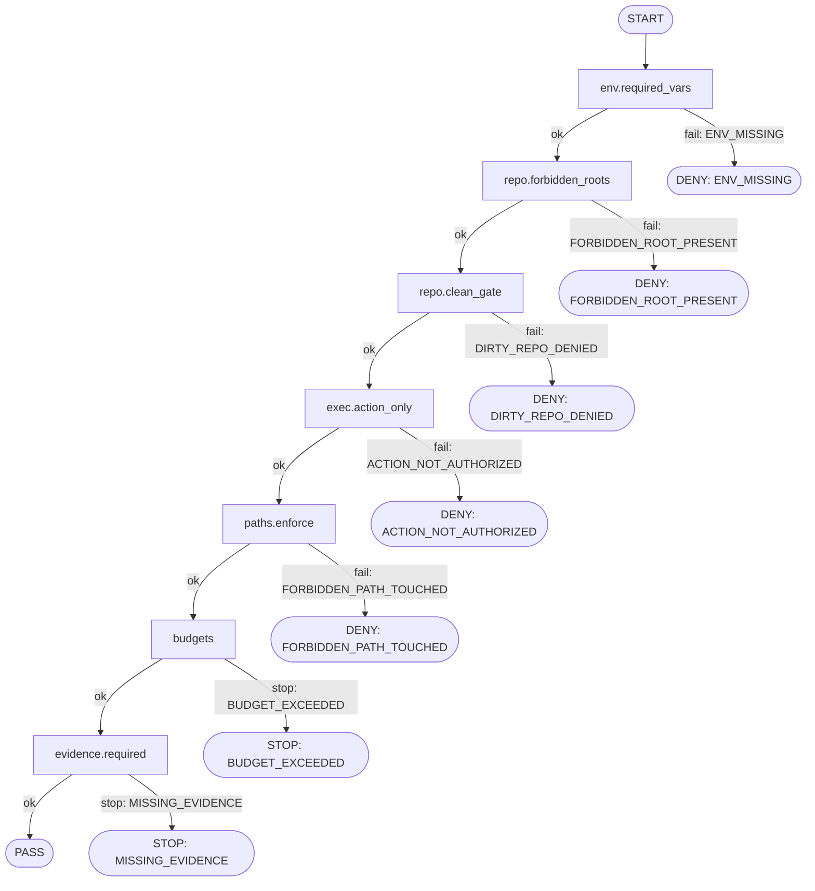

# Authoritative binding spec: explicit SSOT + derived DAG

## Decision
Make the **authoritative binding spec** a **schema-driven PlantSpec + ordered Ruleset** (SSOT), and **derive** a DAG / Mermaid / PlanCards from those SSOT files.

Rationale: a DAG alone doesn’t encode enough structure (invariants, constraints, budgets, evidence, reason codes) unless node metadata becomes the real spec. PlantSpec + Ruleset keeps enforcement requirements explicit and machine-checkable; DAG remains a generated view.

---

## SSOT hierarchy

1. **PlantSpec (schema-driven, machine-readable)**
   - Encodes: invariants, constraints, budgets, allowed actions, evidence requirements, reason codes, phases.

2. **Ruleset / decision table (deny-fast, ordered)**
   - Encodes: ordered checks with `when` → `decision` → `reason_code` (+ required evidence where relevant).

3. **Derived views (generated; regen-and-compare)**
   - **DAG (JSON + Mermaid)**: visualization of ordered rules + phase edges.
   - **PlanCards (5W+H)**: human-facing brief per phase/packet.
   - **State machine**: optional; useful if you need explicit transition guards beyond phased rules.

---

## File layout (recommended)

```
control/spec/binding/
  plant_spec.json
  ruleset.json
control/plant/
  binding_dag.json        # generated
  binding_dag.mmd         # generated
control/plan_cards/
  binding.preflight.md    # generated
  binding.work.md         # generated
  binding.evidence.md     # generated
  binding.promote.md      # generated
tools/
  gen_binding_views.py
```

CI: `python tools/gen_binding_views.py` then **regen-and-compare**; deny merge if generated outputs differ or are missing.

---

## PlantSpec (SSOT) — minimal shape

```json
{
  "spec_id": "xtrl.binding",
  "spec_version": "v0.1",
  "phases": ["preflight", "work", "evidence", "promote"],
  "env": {
    "required_vars": ["CODEX_HOME", "CODEX_STATE", "XTRL_STATE"]
  },
  "invariants": {
    "forbidden_repo_roots": [".codex", ".quint"],
    "no_binary_diffs": true,
    "no_submodules": true
  },
  "actions": {
    "exec_mode": "ACTION_ONLY",
    "allowed_actions": ["preflight", "run", "check", "promote"]
  },
  "constraints": {
    "allowed_paths": [],
    "forbidden_paths": [],
    "diff_budget": {"max_files": 50, "max_lines": 1500}
  },
  "budgets": {
    "max_iterations": 3,
    "max_runtime_seconds": 900
  },
  "evidence": {
    "out_layout": "CODEX_STATE/xtrl/out/<packet_id>/...",
    "required_files": [
      "contract.json",
      "evidence.json",
      "decision_trace.txt",
      "reason_codes.json"
    ],
    "required_signals": ["diffstat", "tests", "lint"]
  },
  "reason_codes": [
    "ENV_MISSING",
    "FORBIDDEN_ROOT_PRESENT",
    "DIRTY_REPO_DENIED",
    "ACTION_NOT_AUTHORIZED",
    "FORBIDDEN_PATH_TOUCHED",
    "BUDGET_EXCEEDED",
    "MISSING_EVIDENCE"
  ]
}
```

Notes:
- PlantSpec is the **single place** that enumerates invariants/constraints/evidence expectations.
- `allowed_paths/forbidden_paths` are typically populated per-packet (contract overlay), but the PlantSpec defines the *slots* and how enforcement behaves.

---

## Ruleset (SSOT) — ordered deny-fast logic

```json
{
  "ruleset_id": "xtrl.binding.rules",
  "spec_ref": "xtrl.binding@v0.1",
  "order": [
    {
      "id": "env.required_vars",
      "when": "missing_required_vars",
      "decision": "DENY",
      "reason_code": "ENV_MISSING"
    },
    {
      "id": "repo.forbidden_roots",
      "when": "forbidden_roots_present",
      "decision": "DENY",
      "reason_code": "FORBIDDEN_ROOT_PRESENT"
    },
    {
      "id": "repo.clean_gate",
      "when": "git_status_not_clean",
      "decision": "DENY",
      "reason_code": "DIRTY_REPO_DENIED"
    },
    {
      "id": "exec.action_only",
      "when": "action_not_in_allowed_actions",
      "decision": "DENY",
      "reason_code": "ACTION_NOT_AUTHORIZED"
    },
    {
      "id": "paths.enforce",
      "when": "touched_forbidden_path",
      "decision": "DENY",
      "reason_code": "FORBIDDEN_PATH_TOUCHED"
    },
    {
      "id": "budgets",
      "when": "budget_exceeded_or_loop_detected",
      "decision": "STOP",
      "reason_code": "BUDGET_EXCEEDED"
    },
    {
      "id": "evidence.required",
      "when": "missing_required_evidence",
      "decision": "STOP",
      "reason_code": "MISSING_EVIDENCE"
    }
  ]
}
```

Notes:
- Rules are **ordered**; the evaluator runs them sequentially and exits on first terminal decision.
- `DENY` vs `STOP` is retained because it maps cleanly to “illegal work” vs “incomplete / needs fix.”

---

## Derived DAG (generated view)

### Derivation rule
- **Nodes** = each `order[]` rule + phase markers.
- **Edges** = rule order + phase edges.
- **Terminal nodes** = for each `decision != ALLOW`, include an explicit terminal sink labeled with `reason_code`.

### Example Mermaid view (generated)



---

## Implementation checklist

1. **Author SSOT files**
   - `control/spec/binding/plant_spec.json`
   - `control/spec/binding/ruleset.json`

2. **Write generator**
   - `tools/gen_binding_views.py` produces:
     - `control/plant/binding_dag.json`
     - `control/plant/binding_dag.mmd`
     - `control/plan_cards/binding.*.md`

3. **Add CI regen-and-compare**
   - Run generator.
   - Fail if generated artifacts differ or are missing.

4. **Wire evaluator**
   - Preflight loads PlantSpec + Ruleset.
   - Evaluates rules in order; emits decision + reason_code.
   - Enforces evidence schema before PASS.

---

## Notes on overlays (per-packet)

- Per-packet contracts should overlay:
  - `allowed_paths`, `forbidden_paths`
  - diff budgets overrides (within global maxima)
  - allowed actions subset
- Overlays must not weaken PlantSpec invariants (e.g., cannot allow `.codex/` or binary diffs).

