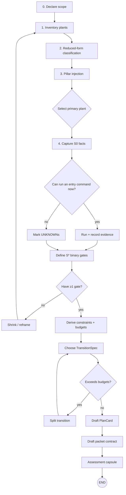

# xtrl-ops — Theory Manual (non-binding)
**Status:** reference / training manual  
**Based on:** xtrl-ops v0.1 (2026-02-01)  
**This document is:** explanatory. It teaches the model, intent, and “how to use it”.  
**This document is not:** a compliance spec.

---

## 0) Why xtrl-ops exists

xtrl-ops standardizes a repeatable way to design and implement tooling (and learn while doing it) with GPT↔Codex collaboration, without losing:
- **control** (bounded actions, explicit sensors/actuators),
- **auditability** (decision trace + evidence),
- **predictability** (stop rules, budgets, reason codes),
- **portability** (XDG layout, no repo-local control roots).

The key idea: treat engineering as a **controlled process** instead of an open-ended conversation.

---

## 1) Mental model

### 1.1 The control loop (daily)
**PlanCard → Run → EvidenceCapsule → Gate → Next PlanCard**

- **PlanCard**: bounded intent (5W+H), risks, mitigations, budgets.
- **Run**: execute within a packet contract (allowed paths + allowed actions).
- **EvidenceCapsule**: mechanical record of what happened (signals + hashes + logs).
- **Gate**: binary pass/fail decision that blocks drift.

### 1.2 Canonical nouns (use these words consistently)
- **PlantSpec**: the system being changed (boundaries, interfaces, invariants, observables, gates).
- **TransitionSpec**: the next *promotable* change (S0 → S1) with a binary gate.
- **PlanCard (5W+H)**: bounded plan tied to TransitionSpec.
- **EvidenceCapsule**: standardized evidence bundle emitted by a run.
- **ReasonCodes**: machine-checkable stop/failure taxonomy (deny-fast, predictable).
- **DecisionTrace**: short rationale tied to invariants and checks.
- **Modes**: supervisory behavior: `NORMAL`, `REPAIR`, `SAFE`.
- **Budgets**: saturation constraints: diff/time/iterations/cost.

---

## 2) XDG layout (why “CODEX_HOME should be clean”)

If config becomes a working directory, it grows unbounded and becomes hard to back up, inspect, or reproduce.
So split:
- **Config** (small): `CODEX_HOME=${XDG_CONFIG_HOME}/codex`
- **State** (runtime): `CODEX_STATE=${XDG_STATE_HOME}/codex`
- **Data** (vendor/collab): `CODEX_DATA=${XDG_DATA_HOME}/codex`
- **Cache** (disposable): `CODEX_CACHE=${XDG_CACHE_HOME}/codex`

For xtrl specifically:
- **xtrl config output**: `$CODEX_HOME/xtrl/Justfile` (generated)
- **xtrl runtime**: `$CODEX_STATE/xtrl/{packets,out,worktrees,log,sessions,history,tmp}`

---

## 3) Skill layout (old vs new)

- Old: `skills/packet-runner`, `skills/packet-template`
- New: `skills-pack/xtrl.packet-runner`, `skills-pack/xtrl.packet-template`
- Compatibility: `skills/` is a symlink layer pointing at `skills-pack/`

Subtree import surface:
- `skills-pack/xtrl.packet-runner` → `$CODEX_HOME/skills/xtrl.packet-runner`
- `skills-pack/xtrl.packet-template` → `$CODEX_HOME/skills/xtrl.packet-template`

Why: a tool-qualified namespace prevents collision and makes importing/exporting deterministic.

---

## 4) Target-aware runner (repo_root + clean gate)

Resolution rules:
- `repo_root`: `--repo-root PATH` wins; else `git rev-parse --show-toplevel`
- **clean gate**: `git -C "$repo_root" status --porcelain` must be empty (untracked counts as dirty)
- `CODEX_HOME`: `--codex-home PATH` wins; else `$CODEX_HOME` or `$XDG_CONFIG_HOME/codex`
- `CODEX_STATE`: `--codex-state PATH` wins; else `$CODEX_STATE` or `$XDG_STATE_HOME/codex`

Hard rule: **deny repo-local `.codex/` and `.quint/`** in target repos.

---

## 5) Initial Plant Assessment (entry procedure)

Purpose: before doing work, force the minimum model needed to avoid drift.

Exit artifacts:
1. Plant inventory (bullets)
2. PlantSpec (S0 facts + S* binary gates + boundaries)
3. Constraint map (hard/soft + budgets)
4. TransitionSpec (S0 → S1)
5. PlanCard for the TransitionSpec
6. Packet draft (contract + exec prompt)
7. Assessment capsule (audit-ready)

DAG (mental model):


Stop rules (default):
- timebox: 25–45 minutes
- stop if: same ambiguity twice, same failure twice, no gate after 2 tries
- on stop: record `ReasonCode + open question + next smallest step`

---

## 6) Evidence standard (what you must capture and why)

### 6.1 Minimum signals (default gate set)
Always required:
- **Correctness**: tests + targeted regression test
- **Integrity**: lint/format/type checks (as applicable)
- **Scope**: diffstat + touched files
- **DecisionTrace**: 5–10 lines (“why” + “why safe”)

Conditionally required:
- **Performance**: before/after benchmark (same harness)
- **Runtime**: logs/tracing summary (only if already in stack)

### 6.2 EvidenceCapsule layout (XDG-clean)
Evidence is written to an **OUT_DIR** resolved by the controller:
- `OUT_DIR = $CODEX_STATE/xtrl/out/<repo>/<packet_id>`

Canonical layout (relative to OUT_DIR):
```text
OUT_DIR/
  evidence.json
  evidence/
    plan.md
    decision.md
    scope.json
    integrity.json
    tests.junit.xml
    regression.md
    perf.json        # optional
    runtime.json     # optional
  logs/              # optional raw logs
  commands.log       # minimal command/output trace
  summary.md         # human capsule
  packet.json        # resolved packet descriptor (frozen)
  contract.json      # materialized contract (frozen)
  exec-prompt.md     # materialized codex prompt (frozen)
```

---

## 7) ReasonCodes (how you stop safely)

ReasonCodes are not “feelings”; they are stable, machine-checkable stop states.

Seed list (extend as needed):
- ITERATION_LIMIT_REACHED
- TIME_LIMIT_EXCEEDED
- COST_BUDGET_EXCEEDED
- LOOP_DETECTED
- FLAKY_TEST_DETECTED
- NONDETERMINISM_DETECTED
- SCHEMA_DRIFT
- SCOPE_CREEP_DETECTED
- MISSING_EVIDENCE
- DEPENDENCY_RULE_VIOLATION
- BENCHMARK_REGRESSION

Controller-reality additions (high-frequency denials):
- DIRTY_REPO_DENIED
- FORBIDDEN_ROOT_PRESENT
- FORBIDDEN_PATH_TOUCHED
- ACTION_NOT_AUTHORIZED
- OUT_DIR_NOT_WRITABLE
- BASE_REF_MISMATCH

---

## 8) Practical “how to use this” (minimal workflow)

1. Pick a target repo (primary plant).
2. Run `xtrl doctor` and confirm config/state paths.
3. Create or select a packet (TransitionSpec).
4. Emit `exec-prompt.md` + `contract.json` into OUT_DIR.
5. Run Codex using `exec-prompt.md` with the contract as binding constraints.
6. Ensure EvidenceCapsule is complete and gate on minimum signals.
7. If blocked, stop with a ReasonCode and a smaller next step.

---

## 9) Smoke tests (from the runner notes)

Inside a target repo:
```bash
python $CODEX_HOME/xtrl/tools/run_packet.py packets/examples/packet-000-foundation.json
```

Outside any repo:
```bash
bash $CODEX_HOME/skills/xtrl.packet-runner/scripts/run_packet.sh   packets/examples/packet-000-foundation.json   --repo-root /path/to/target
```

---

## Appendix A — PlanCard template (copy/paste)
```md
## PlanCard (5W+H)

### WHAT
- Change:
- Expected behavior change:

### WHY
- Goal:
- Success criteria (binary gate):

### WHERE
- Repo + path scope:
- Allowed paths (contract):

### WHEN
- Timebox:
- Stop rules:

### HOW
- Steps (3–7):
- Checks to run:
- Rollback:

### Risks + mitigations
- Risk:
- Mitigation:

### Budgets
- Diff budget:
- Iteration budget:
```
